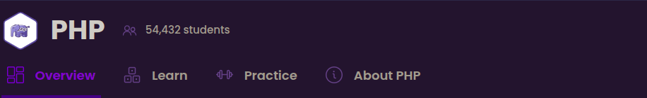
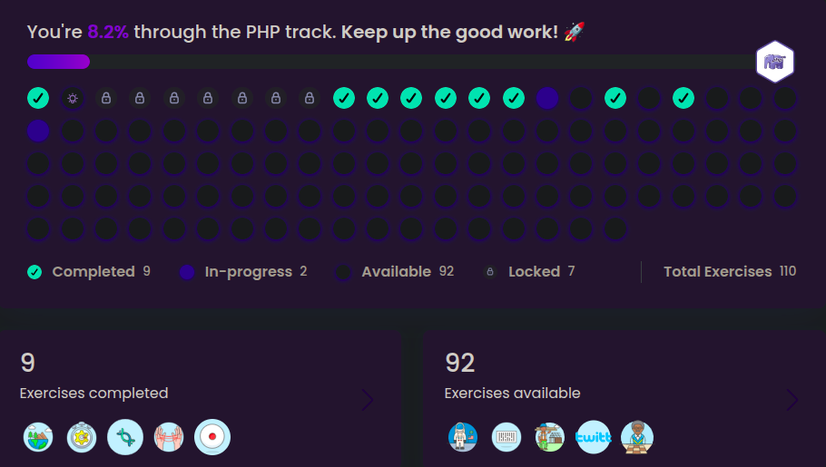

# Explore the PHP exercises on Exercism

Unlock more exercises as you progress. They’re great practice and fun to do!

<div align="center">
    
    
</div>

## The PHP Interpreter
Stack docker for PHP projects  

<div align="center">
    <a href="https://www.php.net">
        
    </a>
</div>

PHP is a popular general-purpose scripting language that is especially suited to
web development. Fast, flexible and pragmatic, PHP powers everything from your
blog to the most popular websites in the world. PHP is distributed under the
[PHP License v3.01](LICENSE).

[](https://github.com/php/php-src/actions/workflows/push.yml)
[](https://bugs.chromium.org/p/oss-fuzz/issues/list?sort=-opened&can=1&q=proj:php)

## Documentation

The PHP manual is available at [php.net/docs](https://www.php.net/docs).

## Services
PHP 

## Requirements

- **Docker** 20.10.12+
- **Docker Compose** 1.25+
- **GIT** 2.25.1+

## How Working Locally With Exercism
Learn how to solve exercises on your local machine  
Solving exercises on your local machine allows you to do all the coding in an environment you're familiar with.  
access link for more information: https://exercism.org/docs/using/solving-exercises/working-locally  

## How to Use
1- Download the shellscript run command `git clone git@github.com:code-chip/exercism-php.git`  
2- Access the fold with `cd exercism-php`  
3- Maintain the stack repository to receive updates `git remote add origin git@github.com:code-chip/stack-php.git`. Verify the change by running the `git remote --v` command.  
```bash
Before:
origin git@github.com:code-chip/exercism-php.git (fetch)
origin git@github.com:code-chip/exercism-php.git (push)

After:
origin git@github.com:your_user_github/exercism-php.git (fetch)
origin git@github.com:your_user_github/exercism-php.git (push)
stack git@github.com:code-chip/stack-php.git (fetch)
stack git@github.com:code-chip/stack-php.git (push)
```
4- Fill in the values ​​of the environment variables in the .docker/.env file. It is important to fill in the correct values ​​of MY_UID and GID, to confirm your user id in Linux run the id command, the terminal should display something close to this:  
```bash
uid=1000(will) gid=1000(will) grupos=1000(will),4(adm),24(cdrom),27(sudo),30(dip),33(www-data),46(plugdev),100(users),105(lpadmin),125(sambashare),127(docker)
``` 
5-To confirm your Docker host IP on Linux, run the command.
```bash
ip -4 addr show docker0 | grep -Po 'inet \K[\d.]+'
``` 
The terminal should display something similar to this:  
```bash
172.17.0.1
``` 
6- Run the command `bin/dev build` or `docker-compose build`.  
7- Start services `bin/dev up` or `docker-compose up -d`.

## Available development commands
* `bin/dev build` will force (re)building the docker-compose stack.
* `bin/dev rebuild` will update the base docker images, build the docker-compose stack, stop the running containers and restart with the freshly built images.
* `bin/dev up` or `bin/dev start` will start the docker-compose stack.
* `bin/dev status` will print the current status of the docker-compose stack.
* `bin/dev restart` will restart the docker-compose stack.
* `bin/dev logs php` will print the logs for the given container.
* `bin/dev console php` will start a bash console inside the PHP container.
* `bin/dev stop php` will stop all running docker-compose stack containers.
* `bin/dev down php` will stop and remove all docker-compose stack containers.
* `bin/dev exec --args` will start a bash console inside the PHP container.

## Access broswer
PHP [http:localhost](http:localhost)

## How use test with PHPunit
vendor/bin/phpunit fold_name/test_name.php